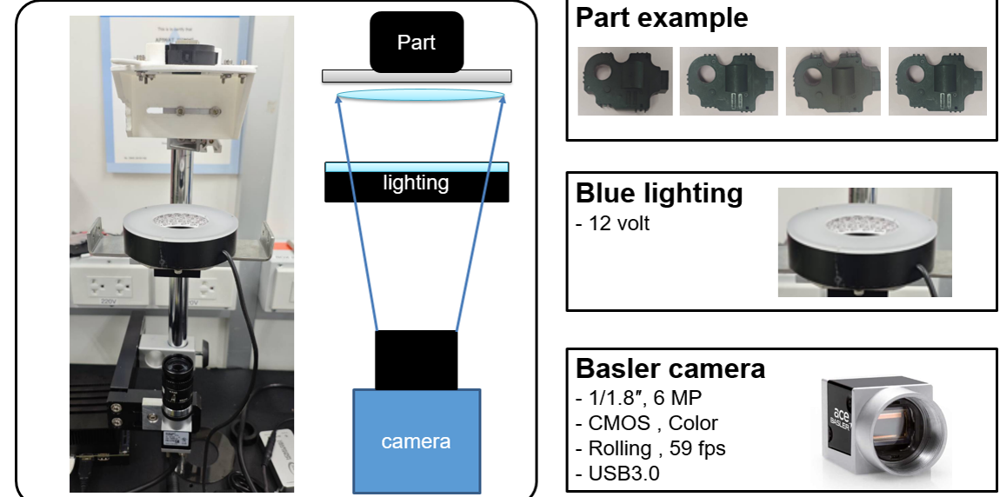
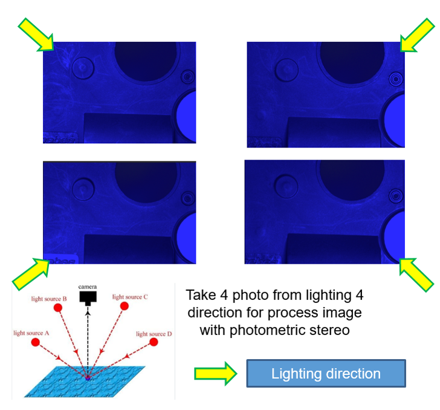
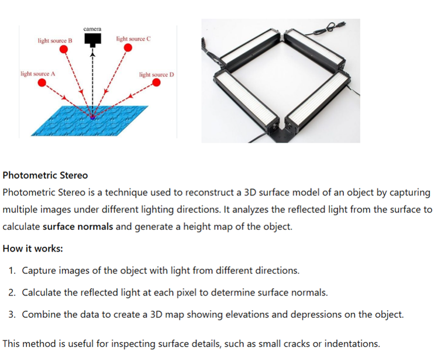
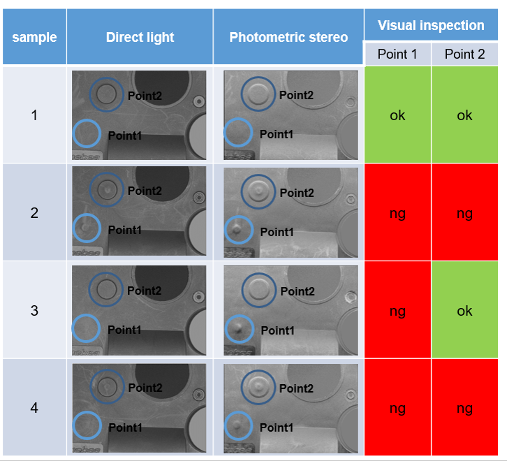
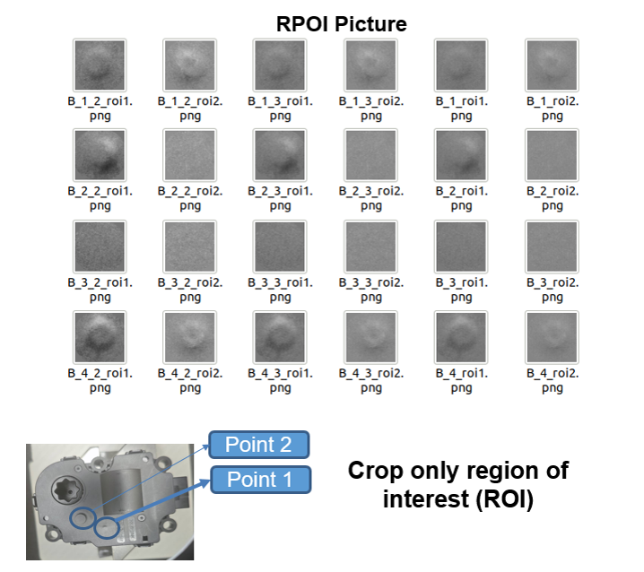
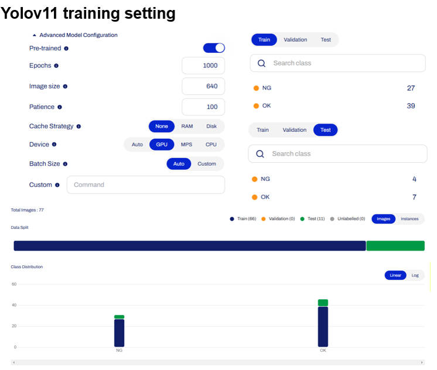
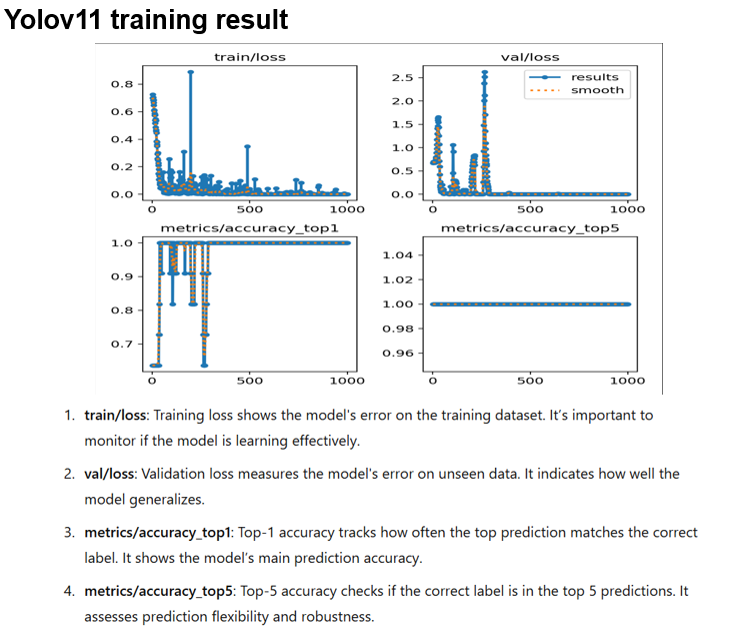
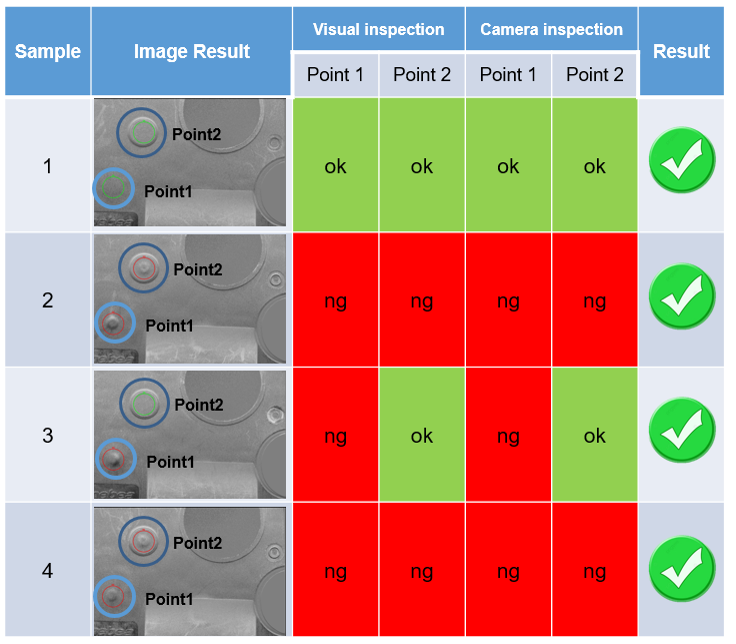

# Camera_Photometic_Stereo
Camera project using photometic stereo
please set and run main in \Camera_Photometic_Stereo\basler\version_4_save_final\main.py
## Device

## What is photometic stereo

## yolo v11 training

## Fianal result
